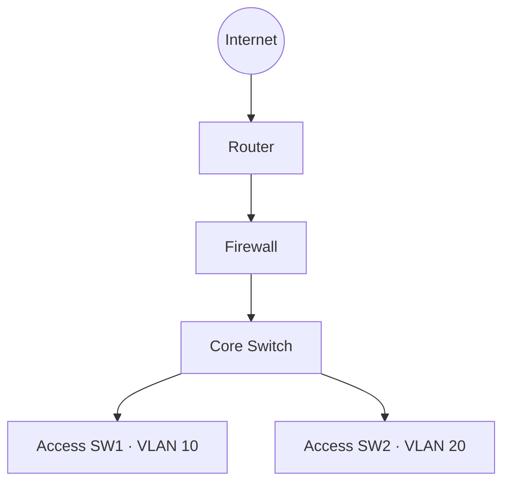

# 中小企业园区网络建设

## 项目目标
模拟一套具备可靠性、可管理性和安全边界的中小企业园区网络，为办公终端、服务器和访客网络提供稳定连接。

## 拓扑草图


## 技术栈
```text
VLAN · Eth-Trunk · MSTP · OSPF · VRRP · DHCP · ACL · NAT
```

## 设计要点
1. 按部门划分 VLAN，减少广播域并便于安全策略实施。
2. 核心层采用 VRRP 提供网关冗余，接入上联使用 Eth-Trunk。
3. 使用 MSTP 控制二层环路，使用 OSPF 完成三层收敛。
4. 在防火墙边界统一实施 NAT 和外网访问控制。

## 当前状态
<span class="status">🚧 Developing</span>
- [x] 完成总体拓扑
- [x] 完成技术选型
- [ ] 地址规划与 VLAN 表
- [ ] 核心交换机配置
- [ ] 安全策略与验收

## 后续验收
- 终端跨 VLAN 访问符合预期
- 任一核心设备故障时业务保持可达
- 外网访问仅开放必要服务
- 故障场景具备清晰的定位命令

