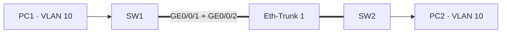

# 华为 eNSP 实验 01：Eth-Trunk 链路聚合配置详解

## 1. 实验目的
在华为 eNSP 中使用 Eth-Trunk 将 SW1 与 SW2 之间的两条物理链路聚合为一条逻辑链路，理解链路聚合对带宽和可靠性的提升。

## 2. 网络拓扑

> 截图占位：将 eNSP 拓扑图保存为 `docs/public/images/eth-trunk-topology.png` 后替换此处。

## 3. 实验需求
- SW1 与 SW2 之间使用两条 GE 链路。
- 创建 `Eth-Trunk 1`，成员接口为 `GE0/0/1` 和 `GE0/0/2`。
- 使用 LACP 模式完成协商。
- 将链路配置为承载 VLAN 10 的 Trunk。
- 验证聚合状态和终端互通。

## 4. 配置过程
### SW1
```text
system-view
sysname SW1
interface Eth-Trunk 1
 mode lacp-static
 port link-type trunk
 port trunk allow-pass vlan 10
 quit
interface GigabitEthernet0/0/1
 eth-trunk 1
 quit
interface GigabitEthernet0/0/2
 eth-trunk 1
 quit
```
### SW2
```text
system-view
sysname SW2
interface Eth-Trunk 1
 mode lacp-static
 port link-type trunk
 port trunk allow-pass vlan 10
 quit
interface GigabitEthernet0/0/1
 eth-trunk 1
 quit
interface GigabitEthernet0/0/2
 eth-trunk 1
 quit
```
### 手工负载分担模式
在不需要 LACP 协商的场景，可将 `mode lacp-static` 替换为 `mode manual load-balance`。两端模式必须保持一致，并确保成员接口的基础配置一致。

## 5. 验证结果
```text
display eth-trunk 1
display interface Eth-Trunk 1
display interface brief
```
期望看到：Eth-Trunk 为 `UP`，成员接口状态为 `Selected`，并且 VLAN 10 终端可以互相 Ping 通。

## 6. 常见问题
| 现象 | 可能原因 | 排查方向 |
| --- | --- | --- |
| Eth-Trunk Down | 两端接口或模式不一致 | 检查成员接口、LACP/手工模式 |
| 成员接口 Unselected | 成员参数不一致或超过活动链路数 | 对比速率、双工、链路类型 |
| VLAN 10 不通 | Trunk 未放行 VLAN 10 | 检查 `port trunk allow-pass vlan 10` |
| 聚合后仍只有一条链路转发 | 哈希算法或流量特征相同 | 使用多流量验证负载分担 |

## 7. 原理总结
Eth-Trunk 将多条物理链路抽象为一个逻辑接口。设备依据流量哈希选择成员链路，因此单个会话通常不会被拆分到多条链路，但多会话可以获得更高的总吞吐量。LACP 还能通过协商和状态检测降低配置错误带来的风险。

## 8. 企业应用场景
- 接入交换机与汇聚交换机之间的上联
- 核心交换机双机之间的高带宽互联
- 数据中心 ToR 与汇聚层的冗余链路
- 需要在不中断业务的情况下扩容链路带宽的场景

